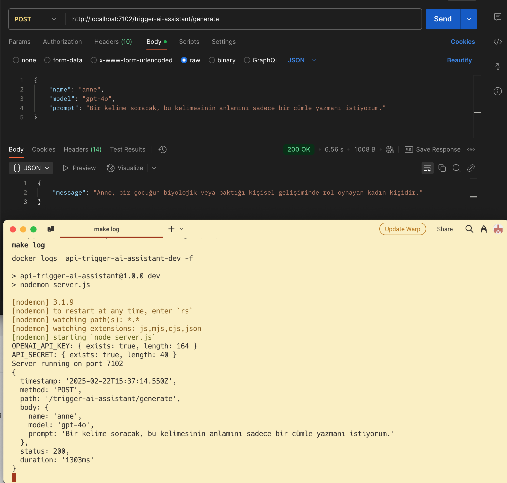

# AI Assistant Trigger API

> Son Güncelleme: 17.02.2025

OpenAI modellerini Supabase veritabanı trigger'ları ile kullanmanızı sağlayan API servisi.

## 📌 Temel Özellikler

- OpenAI GPT entegrasyonu (GPT-4 desteği)
- Güvenli API erişimi
- Docker tabanlı deployment
- Otomatik CI/CD pipeline
- Kapsamlı loglama ve monitoring
- Development/Production ortam ayrımı

## 🚀 Hızlı Başlangıç

1. Gereksinimleri yükleyin:

   - Node.js 20+
   - Docker ve Docker Compose
   - Make (opsiyonel)

2. Ortam değişkenlerini ayarlayın:

```env
OPENAI_API_KEY=your_openai_api_key
API_SECRET=your_api_secret
API_DEV_URL=api-dev.example.com
API_PROD_URL=api.example.com
```

3. Servisi başlatın:

```bash
make restart   # veya
docker compose -f docker-compose.dev.yml up -d --build
```

## 🔌 API Kullanımı

**Endpoint:** `/trigger-ai-assistant/generate-description`

**İstek:**

```json
{
  "name": "İşlenecek metin",
  "prompt": "Sistem talimatı",
  "model": "gpt-4" // Opsiyonel
}
```



**Başlıklar:**

- `x-api-secret`: API güvenlik anahtarı

## 🛡️ Güvenlik Özellikleri

- API Secret doğrulaması
- SSL/TLS şifreleme
- Rate limiting
- Request timeout (60s)
- Request boyut limiti (4MB)
- CORS koruması

## 🔧 Geliştirici Araçları

**Ortam Yönetimi:**

```bash
make restart  # Yeniden başlat
make log     # Logları görüntüle
make ps      # Durum kontrolü
make clean   # Sistemi temizle
```

**Deployment:**

- `dev` branch → Development (`api-dev.example.com:7101`)
- `prod` branch → Production (`api.example.com:7201`)

## 📊 Monitoring

- JSON formatında detaylı loglar
- Request/Response takibi
- Sistem kaynak kullanımı
- Container sağlık kontrolü
- Maximum log boyutu: 10MB (3 dosya)

## 💡 Best Practices

- Traefik reverse proxy kullanımı
- Development ortamında hot-reload
- Multi-stage Docker build
- Otomatik SSL sertifika yönetimi
- Container orchestration uyumluluğu

## 📦 Sistem Gereksinimleri

- 2GB RAM (minimum)
- 10GB disk alanı
- Node.js 20+
- Docker & Docker Compose
